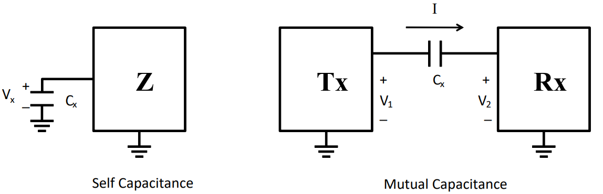
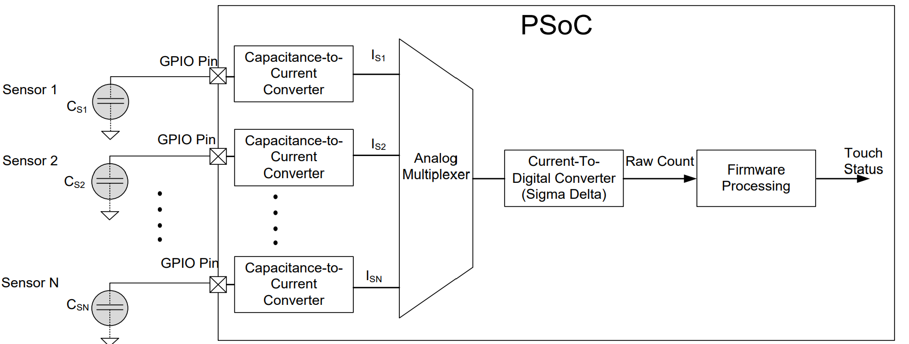
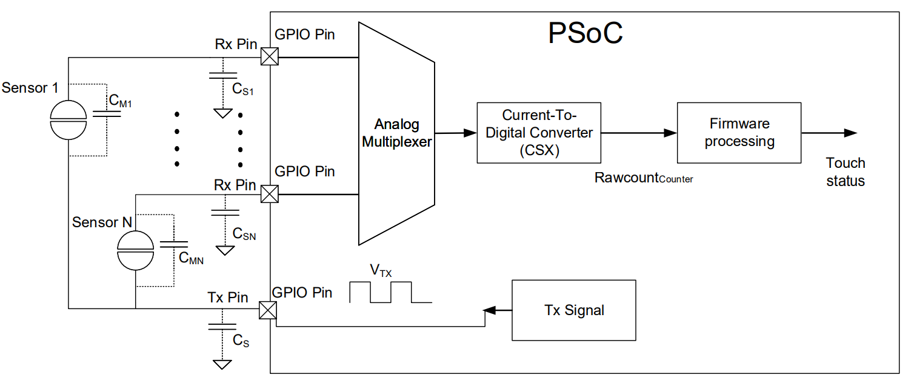
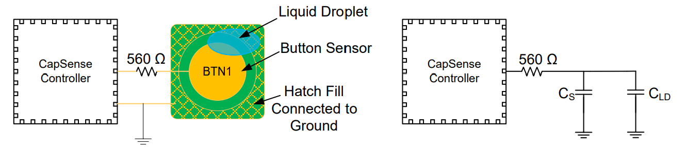
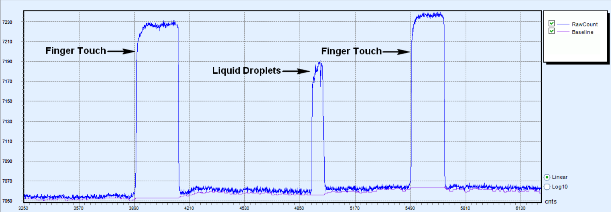
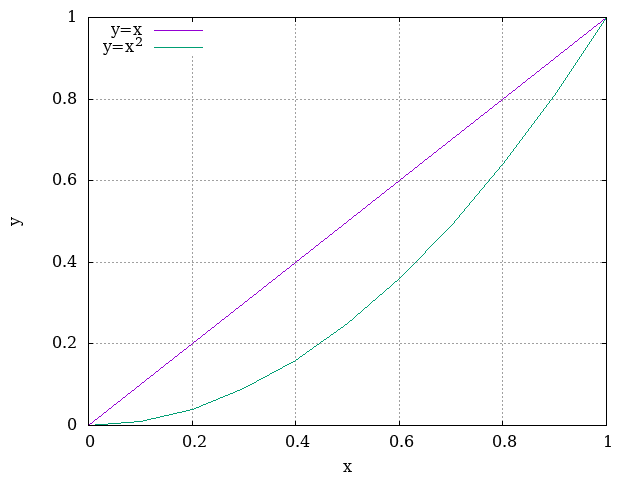
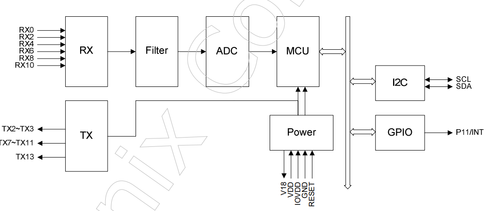
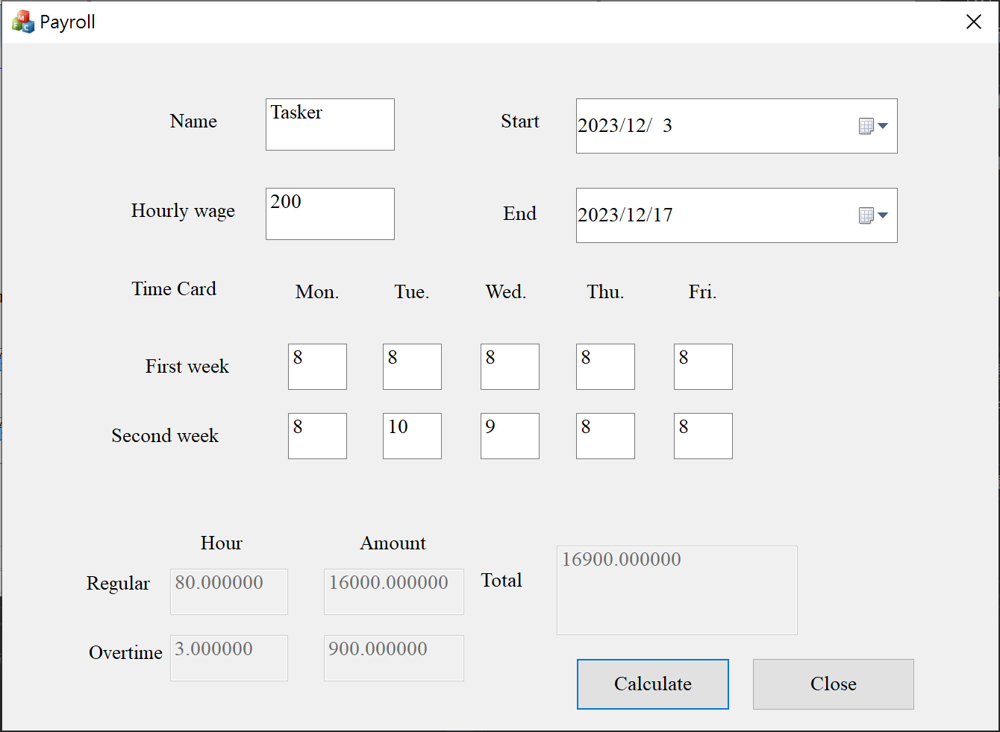

# Self Study

> Name : 郭忠翔
>
> Description : 學習觸控的原理和Linux Kernel，TODO的代表還需要去做部分。

[toc]

## 電容式觸控

>reference : [使用 Cypress CY8CKIT 簡化觸控感測器的設計 | DigiKey](https://www.digikey.tw/zh/articles/simplifying-capacitive-touch-sensor-design-cypress-cy8ckit)
>
>​                    [Getting started with CAPSENSE™ (infineon.com)](https://www.infineon.com/dgdl/Infineon-AN64846_Getting_Started_with_CapSense-ApplicationNotes-v26_00-EN.pdf?fileId=8ac78c8c7cdc391c017d071c431e2179&utm_source=cypress&utm_medium=referral&utm_campaign=202110_globe_en_all_integration-application_note)


###  自電容觸控

- 在自電容觸控感測器中，手指置於感測器上方會形成一條接地的路徑，造成電容量增加，明顯大於感測器和接地面之間的各種電容量來源。
- 在感測器四周進行填充並接地，可改善感測器的雜訊耐受度。
- finger capacitance, $C_F=\frac{\epsilon_0 \epsilon_r A}{D}$
  - $\epsilon_0 =$ Free space permittivity
  - $\epsilon_r =$ Dielectric constant of overlay
  - $A =$ Area of finger and sensor pad overlap
  - $D=$ Overlay thickness
- $C_S = C_P + C_F$
  - $C_P =$  parasitic capacitance of the system
  - $C_S =$ the sensor capacitance

###  互電容觸控(面試提到的部分)

- 當控制器將電壓施加到發射針腳(Tx)時，接收針腳(Rx)上測得的電荷量會與兩個電極間的互電容($C_M$)成正比。
- 能提供比自電容更高的訊噪比 (SNR)，能提升雜訊耐受度。更高的 SNR 代表可穿透更厚的覆蓋層進行操作。
- 陣列配置的感測器能同時追蹤多點的互電容變化。



### Infineon專利的電容式感測方法

- CAPSENSE™ Sigma Delta (CSD) : 用於自電容，各個GPIO都有一個切換電容電路，將感測器電容轉換為等效電流，類比多工器選擇其中一個電流並將其輸入Digital Converter，會得到一個`raw count`，其值會正比於電極間的自電容。



- CAPSENSE™ Crosspoint (CSX) : 用於互電容，將電極間的互電容($C_M$)轉換為等效電流，類比多工器選擇其中一個電流並將其輸入Digital Converter，會得到一個`raw count`，其值會正比於電極間的互電容。



### Noise 來源

#### 水滴影響

- 當水滴落在觸控表面上時，由於其導電性質，它為電場線提供了一個接地，在$C_S$的並聯處增加了一個電容$C_{LD}$。
- 560$\Omega$的串聯電阻，目的是提高抗噪性。





- 解決方法 : (TODO)屏蔽電極被以與感應器切換信號相同的電壓驅動，因此水滴落在觸控表面上時增加的電容將被抵銷。

#### EFT(Electrical Fast Transient) noise

- 由高頻電信號或干擾引起的突然和短暫的電壓波動或干擾。

#### LCM(Liquid Crystal Module) noise

- 由於液晶顯示模組中的電子元件運作而引起的干擾或噪音。

#### Charger noise

- 由於電源本身的噪音。

#### 上述三種噪音解法

- 穩定電源，減少由電源變動引起的噪音。
- 可添加屏蔽層，以防止電磁干擾。
- 使用濾波器來減弱高頻噪音。
- 設計好的接地方式。
- EMC(TODO)

#### 濾波器種類和適合場景

|    Type     | Description                                                  | Application                                                  |
| :---------: | :----------------------------------------------------------- | :----------------------------------------------------------- |
|   Average   | Finite impulse response filter (no feedback)  with equally weighted coefficients. | Periodic noise from power supplies.                          |
|     IIR     | Infinite impulse response filter (feedback)  with a step response similar to an RC filter. | High frequency white noise (1/f noise).                      |
|   Median    | Nonlinear filter that computes median  input value from a buffer of size N. | Noise spikes from motors and switching  power supplies.      |
|   Jitter    | Nonlinear filter that limits current input  based on previous input. | Noise from thick overlay (SNR < 5:1),  especially useful for slider centroid data. |
| Event-Based | Nonlinear filter that causes a predefined  response to a pattern observed in the  sensor data. | Commonly used to block generation or  posting of nonexistent events. |
| Rule-Based  | Nonlinear filter that causes a predefined  response to a pattern observed in the  sensor data. | Commonly used during normal operation of  the touch surface to respond to special  scenarios such as accidental multi-button  selection. |

## Linux Kernel

> 學習資源 : [Linux 核心設計/實作 (Linux Kernel Internals)](https://wiki.csie.ncku.edu.tw/linux/schedule)

### C語言

- 萬能指標，將 `int **` 轉型為 `void *`:  (fine); 將 `void *` 轉型為 `void **`:  (not ok)。C 語言不保證可以安全地轉換 `void *` 為任意型態後，再轉換回原本的型態
- `void *` 的設計，導致開發者必須透過 explicit (顯式) 或強制轉型，才能存取最終的 object，否則就會丟出編譯器的錯誤訊息，從而避免危險的指標操作。也就是說無法直接對 `void *` 做數值操作
- 對某硬體架構像是 ARM，需要額外的 alignment。ARMv5 (含) 以前，若要操作 32-bit 整數 (uint32_t)，該指標必須對齊 32-bit 邊界 (否則會在 dereference 時觸發 exception)。於是，當要從 `void *` 位址讀取 uint16_t 時，需要這麼做：[你所不知道的 C 語言：記憶體管理、對齊及硬體特性 - HackMD](https://hackmd.io/@sysprog/c-memory?type=view)

```C
/* may receive wrong value if ptr is not 2-byte aligned */
/* portable way of reading a little-endian value */
uint16_t value = *(uint16_t *) ptr;
uint16_t value = *(uint8_t *) ptr | ((*(uint8_t *) (ptr + 1)) << 8);
```
- IEEE 754問題

```c
#include <stdio.h>
int main() {
    float sum = 0.0f;
    for (int i = 0; i < 10000; i++) sum += i + 1;
    printf("Sum: %f\n", sum); /* expect 50005000 but get 50002896.000000
    return 0;
}
```
- 改善精準度
```c
#include <stdio.h>
int main() {
    float sum = 0.0f, corr = 0.0f; /* corrective value for rounding error */
    for (int i = 0; i < 10000; i++) {
        float y = (i + 1) - corr; /* add the correction to specific item */
        float t = sum + y; /* bits might be lost */
        corr = (t - sum) - y; /* recover lost bits */
        sum = t;
    }
    printf("Sum: %f\n", sum);
    return 0;
}
```


### GNUPLOT

> 在學習linux kernel時遇到的一個繪圖工具

- introduction : [Gnuplot](https://zh.wikipedia.org/zh-tw/Gnuplot) 是一個開源的科學數據可視化工具，用於繪製 2D 和 3D 圖形。它適用於多種平台，包括 Linux、Windows 和 macOS。

#### 安裝並執行

- install and plot

```bash
sudo apt-get install gnuplot
gnuplot> plot sin(x)
```

- error

```
QStandardPaths: wrong permissions on runtime directory /run/user/1000/, 0755 instead of 0700
```

- solve

```bash
export XDG_RUNTIME_DIR=/var/run/user/1000/0755
```

#### 指令

- 繪圖 : `$ gnuplot [.gp]` (gnuplot script 副檔名為 .gp)
- 檢視 : `$ eog [圖檔名]`

#### gnuplot script 常用設定

- `reset` : 重新設定

- `set term png enhanced font 'Verdana,10'`: 設定圖片類型
- `set output 'XXX.png'`: 設定存檔名稱
- `set title 'XXX'` : 設定圖片標題
- `set xlabel/ylabel 'XXX'` : 設定X軸/Y軸label
- `set grid` : 畫網格

#### 範例練習

- 建立文字檔並編輯

```bash
touch points.txt
vi points.txt
```

- 設定座標檔(points.txt)，第一行為$x$座標，第二行為$y=x$座標，第二行為$y=x^2$座標。

```
0.0 0.0 0.0 
0.1 0.1 0.01
0.2 0.2 0.04
0.3 0.3 0.09
0.4 0.4 0.16
0.5 0.5 0.25
0.6 0.6 0.36
0.7 0.7 0.49
0.8 0.8 0.64
0.9 0.9 0.81
1.0 1.0 1.0
```

- 建立gnuplot script並編輯

```bash
touch script.gp
vi script.gp
```

```bash
reset
set ylabel 'y'
set xlabel 'x'
set grid
set term png enhanced font 'Times New Roman,12'
set output 'output.png'
set key left

plot [0:1.00][0:1.00]\
'points.txt' using 1:2 with lines title "y=x",\
'points.txt' using 1:3 with lines title "y=x^2"
```

- 執行腳本並輸出圖片

```bash
gnuplot script.gp
```



### Protocol in Linux Kernel

- 圖片是ST1615的示意圖，裡面有$I^2C$的通訊協定，可以看[Linux Kernel document中的內容](https://www.kernel.org/doc/html/latest/i2c/index.html)(TODO)



- [12. N-Trig touchscreen Driver — The Linux Kernel documentation](https://docs.kernel.org/input/devices/ntrig.html)(TODO)

## MFC (C++)

- introduction : MFC (Microsoft Foundation Classes) 是一個用於開發 Windows 應用程式的 C++ 框架。它是由 Microsoft 提供的一組類別庫，目的是簡化 Windows 應用程式的開發。
- follow up : 嘗試能不能在VSCode上開發，MFC與[WPF](https://en.wikipedia.org/wiki/Windows_Presentation_Foundation)的比較。
- [大學做過的WPF](./WinFormWPF.md)

- 簡單練習MFC，試著做出一個薪資計算的介面。



