# ME5512 Project

> >Author: 機械四丙 郭忠翔
> >Student ID: B10531019
> >Date: 2021/1/4

## Goal		
### 1.加卦名
### 2.加圖片
### 3.Json引入
### 4.將顯示訊息變成一筆Json資料

## Problem statement 
1.GUI中有些沒用到的元素
2.1/1~1/4節氣判斷有問題

3.資料都是用位置去比對的

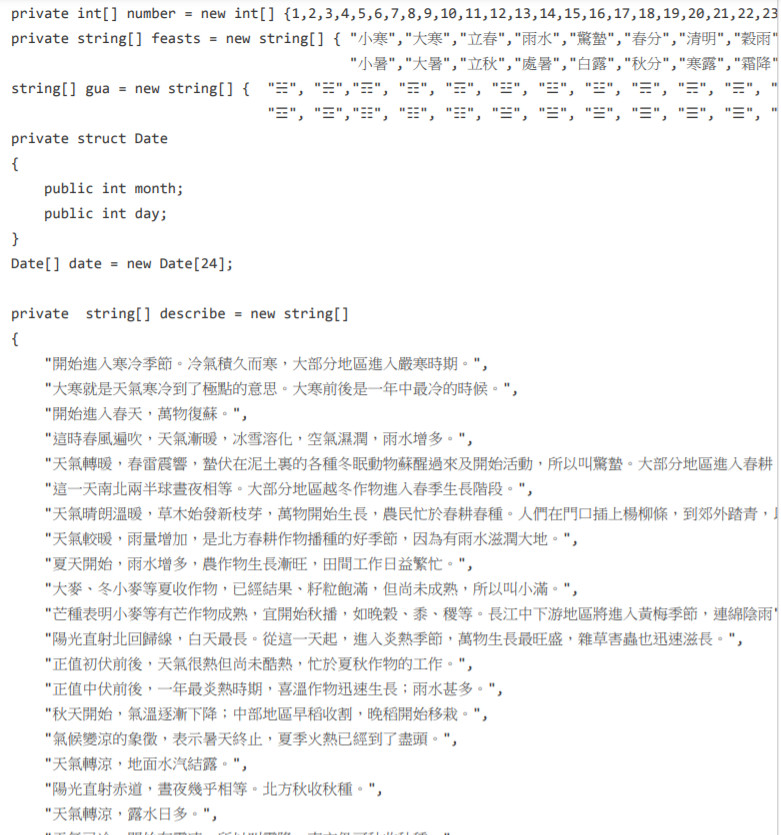

## Refactoring Process 
### 1.使用code_base的程式，先建立一個WinForm的程式

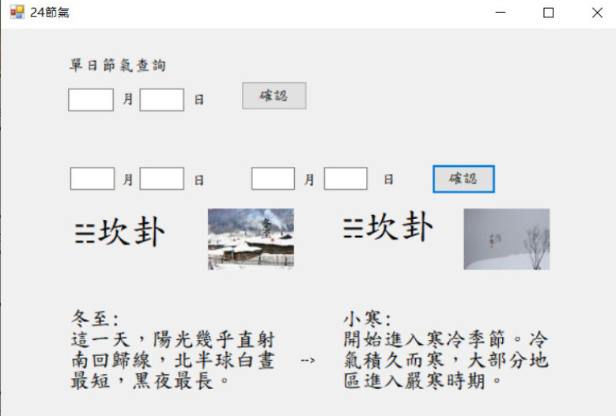

### UML

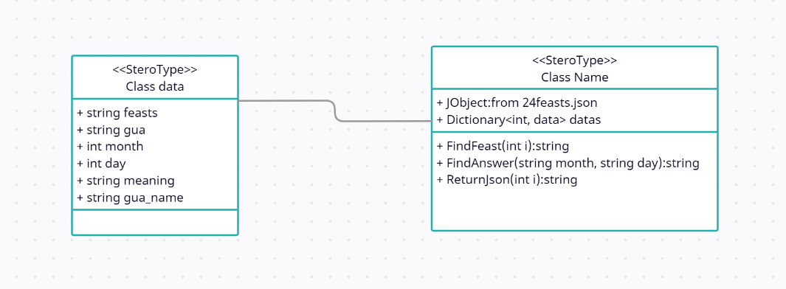

### 2.建立Json檔

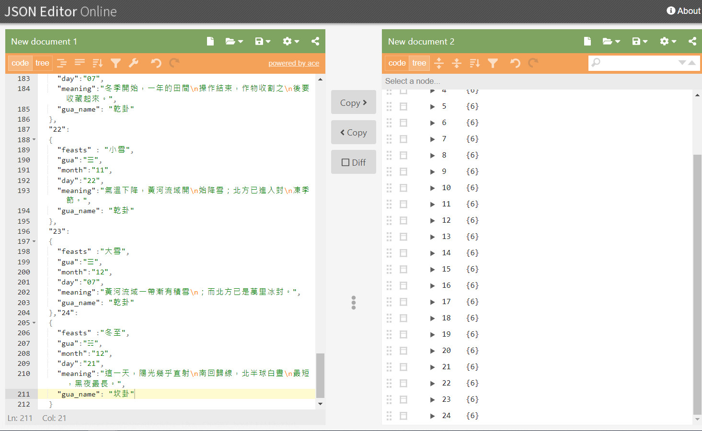
### 3.用WPF重構程式&GUI介面設定

重構GUI介面&刪除不必要的GUI元素

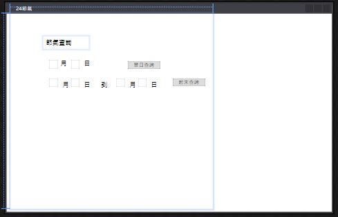

### 3.將json檔讀入程式中

```c#
public JObject o1 { get; set; }
public Dictionary<int, Data> datas = new Dictionary<int, Data>();
public SetData()
{
    //讀入檔案
    using (StreamReader file = File.OpenText(@"./24feasts.json"))
        using (JsonTextReader reader = new JsonTextReader(file))
    {
        o1 = (JObject)JToken.ReadFrom(reader);
    }
    for (int i = 1; i <= o1.Count; i++)
    {
        string str_i = i.ToString();
        string feasts = o1[str_i]["feasts"].ToString();
        string gua = o1[str_i]["gua"].ToString();
        int month = (int)o1[str_i]["month"];
        int day = (int)o1[str_i]["day"];
        string meaning = o1[str_i]["meaning"].ToString();
        string gua_name = o1[str_i]["gua_name"].ToString();
        datas.Add(i, new Data(feasts, gua, month, day, meaning, gua_name));
    }
}
```
data的construtor
```c#
public Data(string feasts, string gua, int month, int day,string meaning,string gua_name)
{
    this.feasts = feasts;     //節氣名稱
    this.gua = gua;			  //卦象
    this.month = month;	      //月
    this.day = day;			  //日
    this.meaning = meaning;	  //節氣意義
    this.gua_name = gua_name; //卦名
}
```

### 4.Method

判斷節氣和Json的回傳

```c#
private struct Date
{
    public int month;
    public int day;
}
Date[] date = new Date[24];

//找是第幾個節日
public int FindAnswer(string month, string day)
{
    var answer = 24; //這個是1/1~1/4判斷不到的地方
    date[0].month = 1; date[0].day = 05;
    date[1].month = 1; date[1].day = 20;
    date[2].month = 2; date[2].day = 04;
    date[3].month = 2; date[3].day = 18;
    date[4].month = 3; date[4].day = 05;
    date[5].month = 3; date[5].day = 20;
    date[6].month = 4; date[6].day = 04;
    date[7].month = 4; date[7].day = 20;
    date[8].month = 5; date[8].day = 05;
    date[9].month = 5; date[9].day = 21;
    date[10].month = 6; date[10].day = 05;
    date[11].month = 6; date[11].day = 21;
    date[12].month = 7; date[12].day = 07;
    date[13].month = 7; date[13].day = 22;
    date[14].month = 8; date[14].day = 07;
    date[15].month = 8; date[15].day = 23;
    date[16].month = 9; date[16].day = 23;
    date[17].month = 9; date[17].day = 23;
    date[18].month = 10; date[18].day = 08;
    date[19].month = 10; date[19].day = 23;
    date[20].month = 11; date[20].day = 07;
    date[21].month = 11; date[21].day = 22;
    date[22].month = 12; date[22].day = 07;
    date[23].month = 12; date[23].day = 21;
    for (int i = 0; i < 23; i++)
    {
        string interval = date[i].day > 10 ? "" + date[i].month + date[i].day : "" + date[i].month + "0" + date[i].day;
        string interval2 = date[i + 1].day > 10 ? "" + date[i + 1].month + date[i + 1].day : "" + date[i + 1].month + "0" + date[i + 1].day;
        string input = month + day;
        if (Convert.ToInt32(input) >= Convert.ToInt32(interval) && Convert.ToInt32(input) < Convert.ToInt32(interval2))
        {
            answer = i + 1;
        }
    }
    return answer;
}

//回傳節日的內容
public string[] FindFeast(int i)
{
    string[] answer = new string[4];
    data data = datas[i];
    answer[0] = data.feasts;
    answer[1] = data.gua;
    answer[2] = data.meaning;
    answer[3] = data.gua_name;
    return answer;
}

//回傳Json字串
public string ReturnJson(int i)
{
    JToken jsonStr;
    jsonStr = o1[i.ToString()];
    string json = JsonConvert.SerializeObject(jsonStr);
    return json;
}
```

按下button後的處理以及將結果寫成Json檔
```c#
private void DoubleClick(object sender, EventArgs e)
{
    SetData data = new SetData();
    if (Convert.ToInt32(TextBox4.Text) < 10)
    {
        TextBox4.Text = "0" + TextBox4.Text;
    }
    //根據輸入判斷節氣
    var date = data.FindAnswer(TextBox3.Text, TextBox4.Text);
    var result1 = data.ReturnJson(date);
    var answer1 = data.FindFeast(date);
    //顯示圖片
    display1(date);


    if (Convert.ToInt32(TextBox6.Text) < 10)
    {
        TextBox6.Text = "0" + TextBox6.Text;
    }
    //根據輸入判斷節氣
    date = data.FindAnswer(TextBox5.Text, TextBox6.Text);
    var result2 = data.ReturnJson(date);
    var answer2 = data.FindFeast(date);
    //顯示圖片
    display2(date);
    //GUI設定

    Label1.Content = answer1[1] + answer1[3];
    Label2.Content = answer1[0] + ":\n" + answer1[2];
    Label3.Content = answer2[1] + answer2[3];
    Label4.Content = answer2[0] + ":\n" + answer2[2];
    TextBox1.Text = ""; //讓所有資料變回空白
    TextBox2.Text = "";
    TextBox3.Text = "";
    TextBox4.Text = "";
    TextBox5.Text = "";
    TextBox6.Text = "";
    //將結果寫成Json檔
    var result = new JObject();
    JObject json1 = JObject.Parse(result1);
    JObject json2 = JObject.Parse(result2);
    result.Add("start", json1);
    result.Add("end", json2);
    Output(result);
}
//顯示圖片
private void display1(int ans)
{
    FileStream fstream = new FileStream($"./GuaPic/{ans}.jpg",FileMode.Open);
    BitmapImage bitmap = new BitmapImage();
    bitmap.BeginInit();
    bitmap.StreamSource = fstream;
    bitmap.CacheOption = BitmapCacheOption.OnLoad;
    bitmap.EndInit();
    Image1.Source = bitmap;
    fstream.Close();
}
//輸出Json檔
private void Output(JObject a)
{
	File.WriteAllText(@"videogames.json", a.ToString());
}
```

### publish

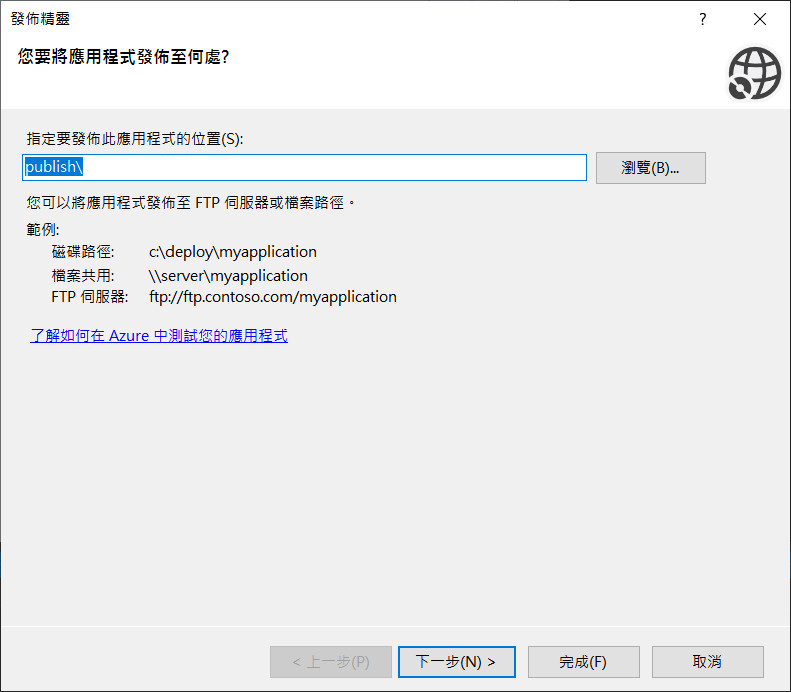

## Execution Result

### GUI_Output

1.加上卦名&圖片

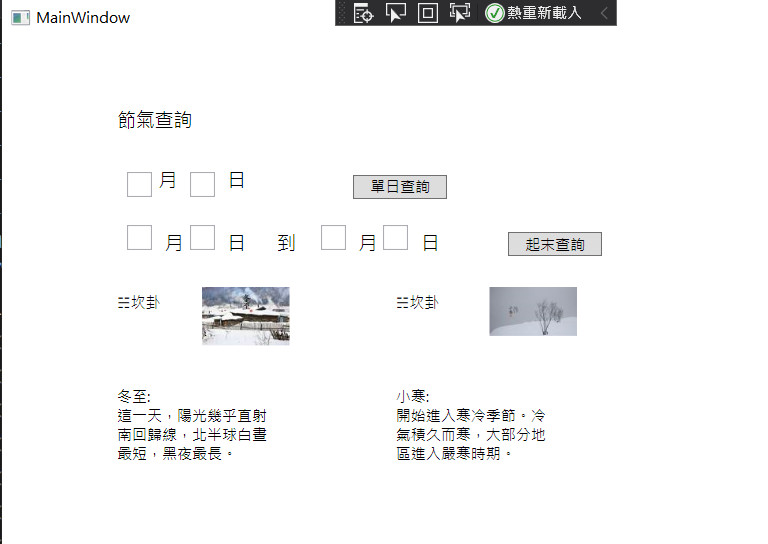
### Json檔

紀錄查詢的兩個節氣的內容

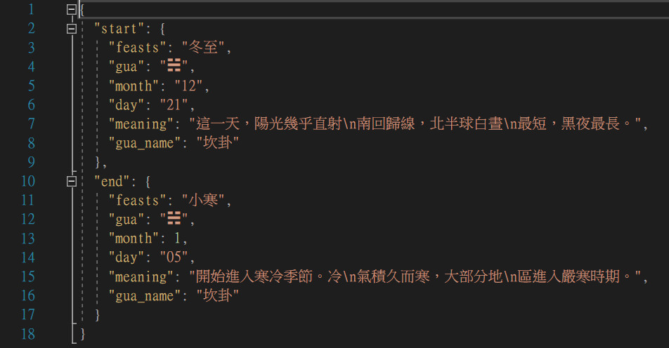

## Effots for New Version

### 1.Json檔的引入&輸出

優點可以在Json檔改資料，不必進到程式內修改，而輸出可以看到上次查詢紀錄

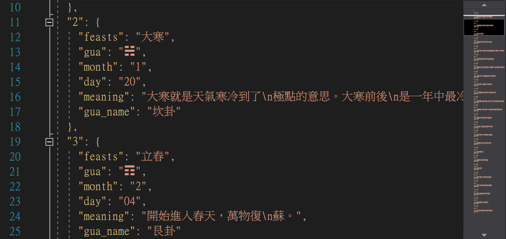

### 2.將資料包裝

優點是要增加資料時比較好修改，不須再用位置去對，程式較易擴充

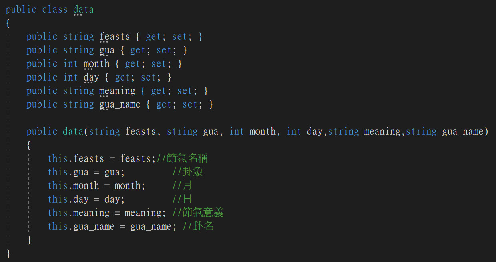

### 3.修改判斷的Method

我是從code_base的方法做修改，並不是完全重寫，我覺得在這部分可以再做精進，使程式碼較易讀，一開始有幾天是不能判斷的

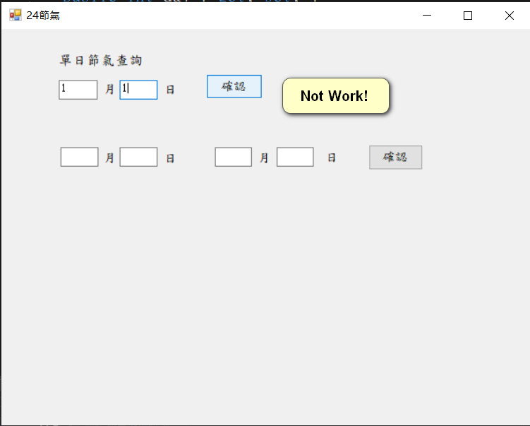

修改後1/1後可以顯示節氣了

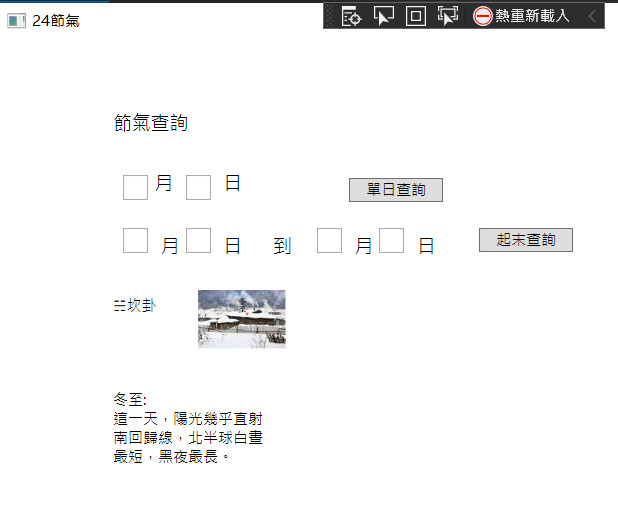

### 4.將Winform改成WPF，使設計和開發的工作分開